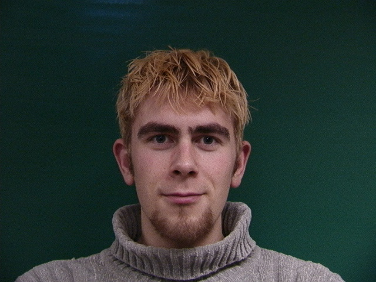
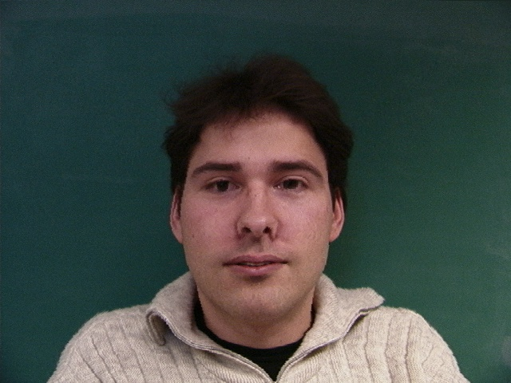
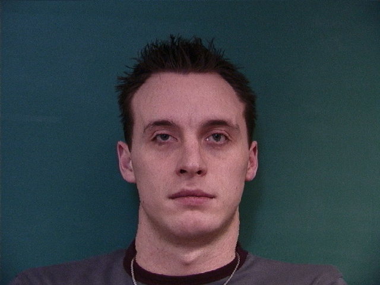
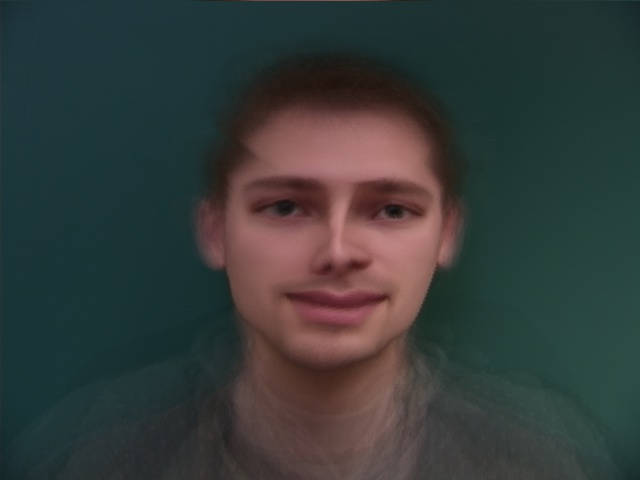
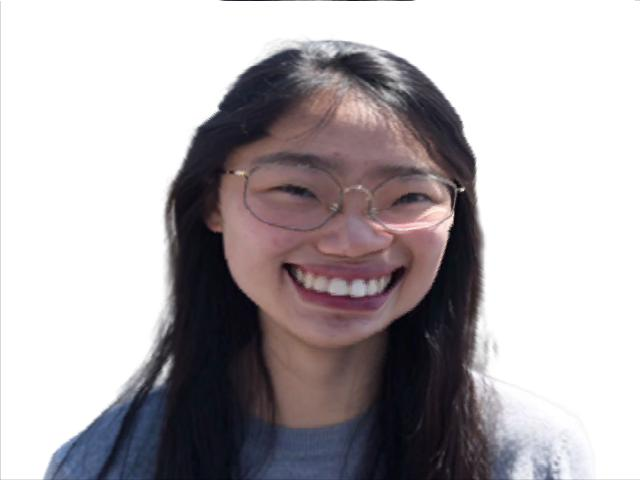
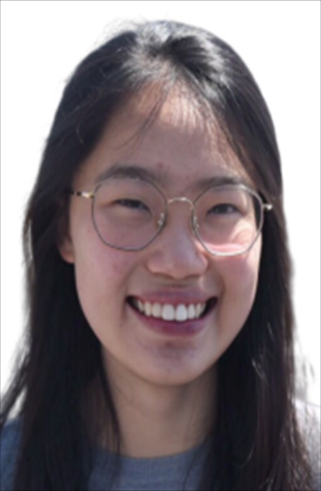

### CS194-26: Image Manipulation and Computational Photography

### Spring 2020

### Project 3:Face Morphing

Violet Yao, violetyao@berkeley.edu

### Overview
In this assignment, I will produce a "morph" animation of my face into someone else's face (from [FEI Database](https://fei.edu.br/~cet/facedatabase.html)), compute the mean of Dane faces (using [IMM Face Database](http://www2.imm.dtu.dk/~aam/datasets/datasets.html)), and extrapolate from a population mean to create a caricature of myself.

### Defining Correspondences

I implemented a GUI to let users label points on face images using ginput according to [this order](https://imgur.com/a/HMOxskg) and wrote the points to local to save time. Then I created the triangulation of these points using  Delaunary from scipy library.

The images below show the Delaunary triangulation of me and target face.

Me            |  Target
:-------------------------:|:-------------------------:
  |  

### Computing the "Mid-way Face"

Firstly, I computed the average of label points from the two original faces to get the average shape. Then I warped both faces into the average shape by applying an affine warp for each triangle from original to average. Lastly, I took the average the color of the two warped images together simply by $\frac{img1 + img2 }{2}$.

Below are the original images and the mid-way face I got.

Me        |  Mid-way | Target
:-------------------------:|:-------------------------:|:-------------------------:
  |   | 

### The Morph Sequence

For this part, I implemented a function $morphed_{im} = morph(im1, im2, im1\_pts, im2\_pts, tri, warp\_frac, dissolve\_frac)$ which produces a warp between im2 and im2 using the corresponding points defined by $im1\_pts$ and $im2\_pts$ and the triangulation structure $tri$. By iterating over $warp\_frac$ and $dissolve\_frac$ from 0 to 1, I created a sequence of 50 intermediate faces.

Below is a animation $gif$ of the 50 images of me morphing into target.

  

### The "Mean face" of a population

For this part, I computed the average male Dane face using [the initially released subset of the IMM Face Database (37 images)](http://www2.imm.dtu.dk/~aam/datasets/datasets.html) by morphing each of the faces in the database to the average shape. Below are some examples.

Raw 0 |  Raw 1 | Raw 2  | Raw 3 | Raw 4
:-------------------------:|:-------------------------:|:-------------------------: |:-------------------------: |:-------------------------:
  |   |  |   |  

Morphed 0 |  Morphed 1 | Morphed 2 | Morphed 3 | Morphed 4
:-------------------------:|:-------------------------:|:-------------------------: |:-------------------------: |:-------------------------:
  |   |  |   |  

 Average Face of the Dane Population 

  

The left is my face warped into the average geometry while the right is the average face warped into my geometry.

Me on Dane Avg            |  Dane Avg on Me
:-------------------------:|:-------------------------:
  |  
### Caricatures: Extrapolating from the mean

Below, I produced a caricature of my face by extrapolating from the population mean from last step. We can observe that from left to right as $warp\_frac$ increases, my smile becomes increasingly exaggerated. ;D

Raw | Caricature 1|  Caricature 2 | Caricature 3  | Caricature 4
:-------------------------:|:-------------------------:|:-------------------------: |:-------------------------: |:-------------------------:
 |   |   |  |  

### Bells and Whistles 1: Change Gender

I changed my gender by adding the difference between average han chinese man and average han chinese woman (from this [post](https://pmsol3.wordpress.com/2009/10/10/world-of-facial-averages-east-southeast-asia-pacific-islander/)).The result image is a bit quirky.

Original           |  Avg Shape
:-------------------------:|:-------------------------:
  |  

Avg Color           |  Shape + Color
:-------------------------:|:-------------------------:
  |  

### Bells and Whistles 2: Produce a face-morphing music video of the students in the class!

<iframe width="420" height="315"
src="https://www.youtube.com/embed/O2p-U615Rzs">
</iframe>

Shoud out to Zixian Zang for organizing this!
